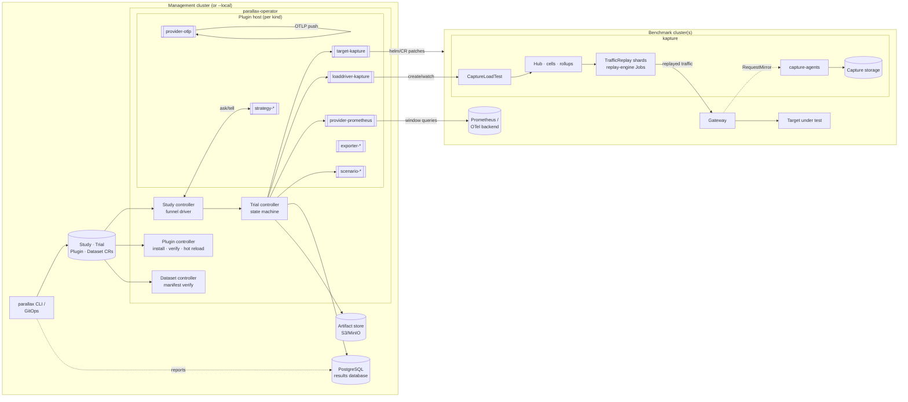
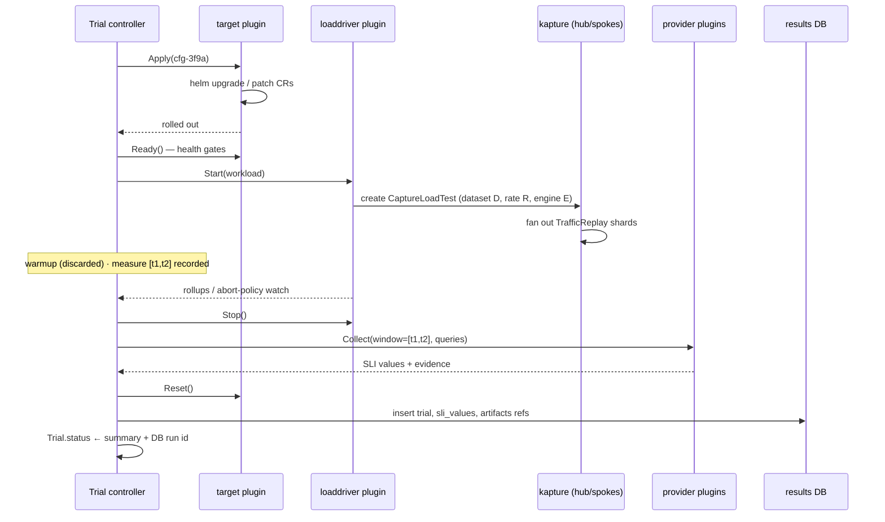
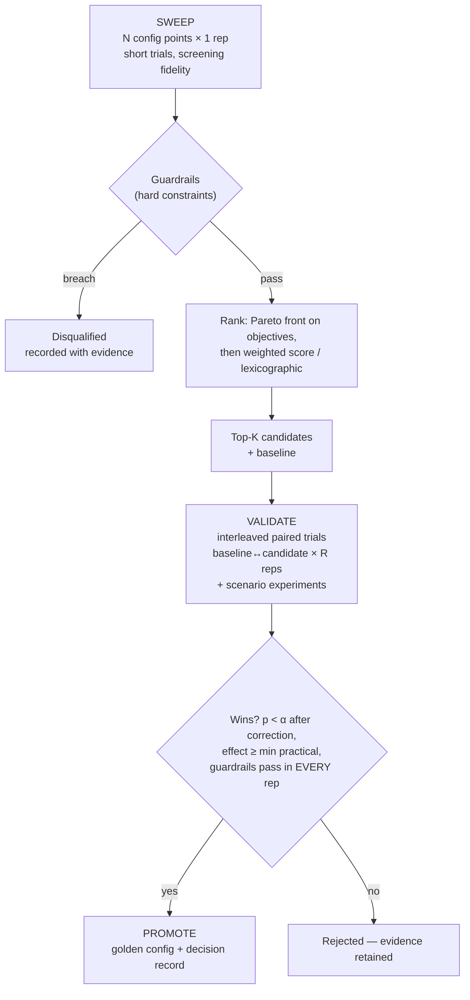
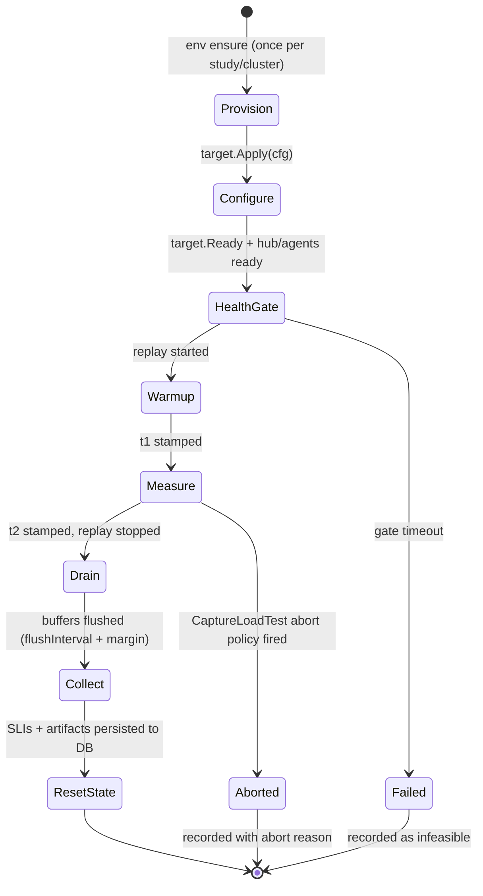

# Parallax — Design Document

**Status**: Draft v2 · 2026-07-18
**Companion system**: [kapture](https://github.com/aburan28/kapture)
**License / positioning**: Apache-2.0, enterprise-grade open source

---

## 1. Problem statement and goals

Tuning a distributed system is an experiment, but it is rarely run like one. Configurations get changed one knob at a time, judged by eyeballing a dashboard for a few minutes, and promoted on anecdote. The result is configs that are locally plausible and globally unjustified — nobody can say *why* the production values are what they are, or whether they are still right after the last three releases.

Parallax makes configuration decisions **reproducible, metric-driven, and statistically defensible**. It is an enterprise-grade, open-source benchmarking and experimentation platform for Kubernetes that:

1. **Tests many configurations** — expands a declarative config matrix (or runs a search strategy) over a system under test, executing an isolated *trial* per configuration under realistic load.
2. **Decides candidates from metrics** — every trial's outcome is a set of SLIs evaluated over the trial's measurement window through pluggable metrics providers (Prometheus first-class, OTel and others via plugins); guardrails eliminate unsafe configs and objectives rank the survivors into a small candidate set, with the full metric evidence recorded in a durable results database.
3. **Validates via experiments** — candidates are never promoted on screening data. They face repeated, interleaved A/B trials against the baseline with nonparametric statistics, plus scenario experiments (soak, burst, failure drills). Only candidates that win *significantly and practically* become the promoted golden config.

Architecturally, parallax is **operator-first and plugin-first**: a Kubernetes operator reconciles `Study`/`Trial`/`Plugin`/`Dataset` CRDs, and every extension seam — targets, load drivers, metrics providers, search strategies, scenarios, exporters — is a **versioned gRPC subprocess plugin**, declared through CRDs, delivered as OCI images, and **hot-reloadable** without restarting the control plane. This generalizes the plugin idiom kapture already proved with its replay-engine ABI.

### Goals

- **G1 — Realistic load**: benchmark under replayed production traffic, not synthetic guesses. Kapture's capture → replay pipeline is the workload engine.
- **G2 — Metric-driven selection**: candidate decisions are computed from metrics over well-defined windows, never from impressions. Decisions are recorded with full provenance (queries, values, thresholds, timestamps).
- **G3 — Statistical rigor at the promotion boundary**: cheap noisy screening is fine for breadth; anything that changes a production default must survive repeated controlled experiments with significance and effect-size thresholds.
- **G4 — Reproducibility**: a study re-run from its spec on the same environment fingerprint produces the same decision, or explains why not (recorded noise, environment drift).
- **G5 — Dogfooding**: kapture itself is the first system under test. Parallax must be able to tune kapture's own data plane and, in doing so, calibrate the load-generation instrument it uses for everything else.
- **G6 — CI/GitOps-embeddable**: studies are CRs; the same machinery runs as a nightly regression gate, a PR smoke benchmark, and an ArgoCD/Flux-managed fleet of recurring studies.
- **G7 — Plugin-first extensibility**: every seam is a versioned gRPC subprocess plugin behind a single ABI. First-party components use the same ABI as third-party ones — there is no privileged in-tree path. Plugins load via CRDs and hot-reload via drain-and-swap.
- **G8 — Enterprise-grade operations**: RBAC-native multi-tenancy, signed supply chain, HA control plane, air-gap installs, durable auditable results in a real database, and no telemetry phone-home.

### Non-goals

- **Not an APM/observability product.** Parallax queries metrics backends through provider plugins; it does not replace them.
- **Not a general CI system.** It orchestrates benchmark studies; scheduling/infra beyond that stays in CI/GitOps.
- **Not autoscaling/auto-tuning in production.** Parallax recommends and gates configs offline. Closing the loop live is out of scope for v1.
- **Not load testing arbitrary protocols.** v1 speaks what kapture replays: HTTP and gRPC.
- **Not open-core.** Security, HA, and multi-tenancy are not held back for a paid tier; the whole platform is Apache-2.0.

---

## 2. Background: what kapture provides

Kapture (`capture.gateway.io/v1alpha1`) is a Kubernetes-native traffic system with two halves that parallax composes:

**Capture** — a hub-and-spoke control plane. Spoke controllers reconcile `TrafficCapture` CRs: they deploy capture-agent pods (HTTP sink `:8080`, gRPC sink `:9090`, health/metrics `:8081`), inject a Gateway API `RequestMirror` filter into the target `HTTPRoute`/`GRPCRoute`, apply capture filters (header match, path prefix, percentage sampling) with credential-header redaction, and stream batched, gzip-compressed JSONL through a bounded async write queue to pluggable storage (`CaptureStorage`: S3 / GCS / EFS / EBS / plugin). The hub (`CaptureHub`, cluster-scoped) maintains a spoke registry over gRPC (register / heartbeat / directives / status reporting) and aggregates fleet state, including per-cell rollups.

**Replay & distributed load testing** (merged via kapture PRs #19/#20) — spokes register into named **cells**; the hub-side **`CaptureLoadTest`** CR fans a capture out as **replay shards** across the spokes of selected cells (`distribution.{cells, maxSpokes, workersPerSpoke, concurrencyPerWorker, presharded}`), splitting an aggregate request rate, rolling up per-cell status, and enforcing an abort policy (`abort.{maxDuration, errorPercent, minSampleRequests}`) plus a target-safety allowlist. Spokes materialize **`TrafficReplay`** shards executed as replay-engine Jobs. The replay engine has a **versioned gRPC ABI** (`proto/replayengine/v1`) with out-of-the-box engines (`builtin`, `k6`, `ghz`) running as subprocess plugins; sharding is deterministic (FNV-1a over request IDs — disjoint and exhaustive, verified in TLA+); rate modes are `Constant` (aggregate RPS split across shards), `OriginalTiming` (recorded pacing, optionally time-scaled), and `Unlimited`. Engines emit a JSON **run report** (sent/failed/filtered counts, achieved RPS, mean/p50/p95/p99 latency) that lands in `TrafficReplay.status` and rolls up per-cell into `CaptureLoadTest.status`.

Two properties make this an unusually good benchmarking substrate:

- **Record once, replay many**: a captured dataset is a *versioned, deterministic workload artifact*. Every trial in a study replays the same bytes with the same sharding — the workload variance across trials is ~zero, so observed differences are attributable to config changes.
- **A closed loop for self-testing**: replaying dataset *D* through a gateway that is *also capturing* should reproduce *D* (modulo declared sampling). Set-reconciling replayed request IDs against captured request IDs measures capture completeness *exactly* — not estimated from counters, but proven from data.

Kapture has also field-tested three different plugin mechanisms: replay engines as **gRPC subprocesses** (magic-cookie handshake, unix socket, hot reload), storage writers as **Go `plugin` packages**, and payload processors as **CR-configured pipelines**. The subprocess model is the one that survived contact with operations — Go plugins impose exact-toolchain lockstep, and in-process pipelines can't be sandboxed or hot-swapped. Parallax standardizes on the subprocess model for *every* extension point (§5) and inherits its conventions deliberately, so anyone who has written a kapture replay engine already knows how to write a parallax plugin.

All kapture facts this design pins against (CRD schemas, flags, metric names, run-report format, chart values) are collected in **Appendix A**, verified against kapture main at commit `fd1ac5a`.

---

## 3. Concepts and terminology

| Term | Meaning |
|---|---|
| **Target** | The system under test, behind a target plugin. v1 targets: `kapture` (self-benchmark) and `helm` (any Helm/manifest-managed service). |
| **Config point** | One concrete assignment of values to every dimension in the search space; canonicalized and content-hashed (`cfg-<hash8>`). |
| **Baseline** | The named config point representing current defaults. All comparisons anchor here. |
| **Workload** | A traffic specification: which capture dataset to replay, at what aggregate rate/pattern, with which engine, for how long. |
| **Dataset** | A captured traffic artifact registered as a `Dataset` CR (capture ref + storage location + manifest: request count, ID digest, size, protocol mix), optionally pre-sharded. |
| **Trial** | One execution of (config point × workload × environment), materialized as a `Trial` CR driven through the trial state machine, producing SLI rows in the results database + artifacts. |
| **SLI** | A named scalar computed from a trial by a metrics **provider plugin** (§11): a PromQL window query, aggregated engine run reports, storage readback, or arithmetic over other SLIs. |
| **Provider** | A metrics-provider plugin serving SLI queries. Each provider declares a trust **class**: `system` (sampled backend metrics), `client` (exact sender-side counts), `fidelity` (exact data-at-rest reconciliation), `derived`. |
| **Guardrail** | A hard predicate over SLIs (e.g. `capture_loss_ratio == 0`); any breach disqualifies the config point regardless of scores. |
| **Objective** | An SLI to optimize, with direction and a minimum practical effect. One primary; optional secondaries. |
| **Candidate** | A config point that survived guardrails and ranked highly enough in selection to earn validation. |
| **Experiment** | A validation procedure for a candidate: paired repeated A/B trials vs. baseline and/or scenario drills. |
| **Study** | The whole declarative unit, a namespaced CR: space + workloads + SLIs + guardrails + objectives + budgets + validation plan. One CR, one results-DB run, one final decision. |
| **Plugin** | A versioned gRPC subprocess implementing one plugin kind, declared by a `Plugin` CR, delivered as an OCI image, hot-reloadable. |
| **Plugin host** | The controller-side runtime that installs, launches, health-checks, drains, and swaps plugin subprocesses. |
| **Promotion** | The recorded outcome of a study: a golden config artifact + decision record (DB row + exported JSON), usable as a deployment overlay and a CI regression reference. |

---

## 4. Architecture

Parallax is a Kubernetes **operator** plus a thin CLI. The operator watches four CRDs (`Study`, `Trial`, `Plugin`, `Dataset` — §6), runs every extension point as a subprocess plugin (§5), records all results in a **PostgreSQL results database** with large artifacts in object storage (§15), and drives kapture CRs for load. The CLI (`parallax`) is a client: it applies/watches CRs, queries the results DB for reports, and can also run the same control loop embedded (`--local`) for laptop/CI use without a cluster-installed operator.



### 4.1 Components

**Study controller** — owns the funnel (§7). Expands or searches the space via strategy plugins, materializes `Trial` CRs, enforces budgets (trials / cluster-time / wall-clock), writes every observation to the results DB, and advances the study through `Sweeping → Selecting → Validating → AwaitingApproval → Promoted|Rejected` phases with conditions and Events at every transition.

**Trial controller** — executes one `Trial` CR through the state machine (§9) by calling plugins: target (`Apply`/`Ready`/`Reset`), load driver (start/watch/stop replay), providers (collect SLIs over the recorded window), scenario (fault injection when the trial is a scenario rep). Persists SLI rows + artifacts, then updates `Trial.status`.

**Plugin controller + plugin host** — reconciles `Plugin` CRs: resolves the OCI image to a digest, verifies signatures per policy, runs the installer (initContainer pattern borrowed from kapture's `replayEngine.pluginImage`) to place binaries in the shared plugin volume, and lets the host fsnotify-watch, launch, health-check, drain, and swap subprocesses (§5.4).

**Dataset controller** — verifies `Dataset` CRs against storage (manifest ↔ slice manifests ↔ objects) and stamps digests used by readback fidelity SLIs.

**Results store** — PostgreSQL system of record + object-store artifacts (§15). The store is core, not a plugin (transactional integrity and cross-study queries demand one schema); fan-out to other systems is an `exporter` plugin concern.

**CLI** — `parallax apply|status|report|promote|datasets|env|ci|db`. Thin: talks to the API server and the results DB. `--local` embeds the controllers and plugin host in-process against any kubeconfig (kind included) with SQLite standing in for Postgres — the enterprise and laptop paths run the same code.

### 4.2 Trial sequence



---

## 5. Plugin architecture

Everything extends through one mechanism: **gRPC subprocess plugins** behind a versioned ABI (`proto/plugin/v1`), loaded via `Plugin` CRs, delivered as OCI images, hot-reloaded with drain-and-swap. The conventions are deliberately kapture's (Appendix A.2), generalized.

### 5.1 Plugin kinds

| Kind | Service (beyond lifecycle) | First-party plugins | Swap boundary |
|---|---|---|---|
| `target` | `Prepare / Apply / Ready / Reset / Contract` | `target-kapture` (chart overlays, CR patches, health gates, **readback fidelity provider**), `target-helm` (generic values/patches) | trial boundary |
| `loaddriver` | `Plan / Start / Watch (stream) / Stop` | `loaddriver-kapture` (CaptureLoadTest composition + rollup watch; `direct` mode runs engine Jobs without the hub) | trial boundary |
| `provider` | `Capabilities / Collect(window, queries) / Snapshot` | `provider-prometheus` (any PromQL-compatible endpoint: Prometheus, Thanos, Mimir, VictoriaMetrics, Cortex), `provider-otlp` (hosts an OTLP receiver; SUTs/engines push OTel metrics, provider aggregates over the window), `provider-runreport` (kapture `TrafficReplay`/`CaptureLoadTest` statuses) | trial boundary |
| `strategy` | `Init(space, budget) / Ask / Tell / Report` | `strategy-grid`, `strategy-random`, `strategy-sobol`, `strategy-asha` (also compiled in for `--local` zero-dep runs), `strategy-optuna` (Python) | between ask/tell calls |
| `scenario` | `Inject / Verify / Revert (stream events)` | `scenario-pod-kill`, `scenario-netpol-outage`, `scenario-rate-burst`, `scenario-hpa-ramp` | trial boundary |
| `exporter` | `Export(event, refs)` | `exporter-webhook`, `exporter-slack`, `exporter-ocibundle` (pushes report bundles as OCI artifacts) | anytime (idempotent) |

The `derived` SLI class is evaluated in-core (pure arithmetic over already-collected SLIs — no subprocess needed, nothing to extend).

### 5.2 The ABI

Every plugin implements the **lifecycle service**:

- `Describe() → {name, kind, abiVersions[], configSchema (JSON Schema), capabilities[], build {version, vcsRef}}` — version negotiation: the host offers its supported ABI versions, the plugin picks; N-1 supported.
- `Configure(config) → {accepted, reason}` — fail-fast validation of the CR-supplied config against the plugin's own schema; a rejection lands verbatim in `Plugin.status`.
- `Health() → {ok, detail}` — liveness for the host's supervisor loop.
- `Drain() → {}` — finish in-flight work, refuse new; idempotent (hot reload and shutdown both use it).

plus its kind service (§5.1). Process contract, identical in shape to kapture's replay engines: the host launches the binary with `PARALLAX_PLUGIN_MAGIC=parallax-plugin` and a socket-dir env; the plugin prints exactly one stdout line `PARALLAX-PLUGIN|1|unix|<socket-path>|grpc` within 15s and logs only to stderr. Discovery by naming convention: `parallax-<kind>-<name>` in the plugin dir (default `/plugins`). SDKs: `pkg/plugin` (Go) and a thin Python `parallax_plugin` package (used by `strategy-optuna`), so the ecosystem isn't Go-only.

### 5.3 Loading plugins through CRDs

```yaml
apiVersion: parallax.dev/v1alpha1
kind: Plugin
metadata:
  name: strategy-optuna
spec:
  kind: strategy
  image: ghcr.io/aburan28/parallax-strategy-optuna:1.4.2   # tag or digest
  verify:
    cosign:
      keylessIdentity: "https://github.com/aburan28/parallax/.github/workflows/release.yaml@refs/tags/*"
      rekor: true
    requireDigestPin: false          # org policy may force @sha256 refs
  config:                            # defaults, schema-validated via Describe()
    sampler: tpe
    multivariate: true
  namespaceSelector: {}              # which namespaces' Studies may use it (empty = all)
status:
  phase: Ready                       # Pending → Verifying → Installing → Ready | Failed | Degraded
  resolvedDigest: sha256:9f2c…
  abiVersion: v1
  installedOn: [operator-0, operator-1]
  conditions: [{type: Verified, status: "True"}, {type: Loaded, status: "True"}]
```

The Plugin controller resolves the image, **verifies the cosign signature** per policy, runs the plugin-installer (extracts `parallax-*` binaries into the shared plugin volume with atomic temp-file + rename — kapture's installer semantics), and records the digest. `Study` specs reference plugins by name; admission rejects a Study whose plugins aren't `Ready` or aren't permitted in its namespace.

### 5.4 Hot reload

- The host fsnotify-watches the plugin dir (debounced ~500ms, matching kapture). A changed binary (new digest from a `Plugin` CR update rolling through the installer) triggers **drain-and-swap**: `Drain()` the old subprocess (bounded grace, default 30s), launch the new one, `Describe`/`Configure`, then route new calls to it. A failed reload keeps the old process running and marks the `Plugin` CR `Degraded` with an Event — never a silent downgrade to nothing.
- **Swap boundaries protect trial integrity** (§5.1): `target`, `loaddriver`, `provider`, and `scenario` plugins are only swapped *between* trials — a running trial pins its plugin set (the resolved digests are part of the trial's environment fingerprint, so a mid-study plugin upgrade is visible in the data and validation refuses to mix fingerprints). `strategy` swaps between ask/tell calls; `exporter` swaps anytime.
- Rollback = re-point the `Plugin` CR at the previous digest; same path, no special case. GitOps-friendly by construction.

### 5.5 Plugin security model

- **No ambient credentials.** Plugins get no secrets by default. The host mediates: providers receive scoped, short-lived tokens for exactly the endpoints their `Plugin` CR names; the kapture target plugin is the only component holding capture-storage read credentials (mirroring kapture's host-owns-storage boundary); strategies and exporters get none unless the CR grants them.
- **Sandboxed subprocesses**: plugins run inside the operator pod's restricted context (distroless nonroot, read-only rootfs, no-new-privileges, RuntimeDefault seccomp) — they are peers of the host process, not privileged sidecars. Per-call deadlines and circuit breakers stop a wedged plugin from wedging the operator; a plugin crash fails its trial, never the control plane.
- **Supply chain**: signature verification before install (§5.3), digest recording in the DB audit trail, SBOMs published per release (§17.2).

### 5.6 Conformance

Each kind ships a conformance suite runnable against any plugin binary (`parallax plugin conformance ./parallax-strategy-mine`): handshake, schema validation, drain semantics, and kind-specific behavior — for strategies, the PR #18 synthetic problems (§19); for providers, canned query/window fixtures; for targets, a fake cluster (envtest). Passing conformance is the bar for the community catalog (§22).

---

## 6. CRD API

Group `parallax.dev/v1alpha1`. Kubebuilder conventions throughout (conditions, printcolumns, Events, finalizers, owner refs — kapture house style).

| CRD | Scope | Purpose |
|---|---|---|
| `Study` | namespaced | The declarative experiment (§8). Status: funnel phase, counts, candidate list, decision/promotion refs, DB run id. |
| `Trial` | namespaced, owned by Study | One trial execution; spec is the resolved (config point, workload, fidelity, rep, mode); status is the state machine + SLI summary + DB row refs. High-cardinality by design — GC'd by owner deletion, full data lives in the DB. |
| `Plugin` | cluster-scoped | Plugin registration, verification policy, config, namespace gating (§5.3). |
| `Dataset` | namespaced | Registered workload dataset: capture ref, storage, manifest stats, ID digest, preshard layout; status: `Verified` with digests (§10). |

`Trial` status sketch:

```yaml
status:
  phase: Collected            # Pending→Configuring→HealthGate→Warmup→Measuring→Draining→Collecting→Collected | Failed | Aborted | Invalid
  timeline: {applied: …, ready: …, t1: …, t2: …, drained: …}
  fingerprint: {k8s: v1.31.0, plugins: {target-kapture: "sha256:…"}, images: {…}}
  slis:                       # summary only; full evidence rows in the DB
    - {name: capture_loss_ratio, class: fidelity, value: "0"}
    - {name: client_p99_ms, class: client, value: "41.7"}
  guardrails: {passed: 6, failed: 0}
  run: {db: postgres, runID: 8821, trialID: 104512}
```

Everything is GitOps-native: a Study in a git repo, applied by ArgoCD, progresses on its own; approvals (§13.4) are CR annotations or CLI verbs; the decision evidence is queryable in the DB and mirrored as artifacts.

---

## 7. The funnel: sweep → select → validate

The platform's core methodological claim: **breadth and depth are different instruments, and confusing them is how bad configs get promoted.** Screening trials are short and unreplicated — perfect for exploring hundreds of points, useless for promotion. Validation trials are long, repeated, and interleaved — too expensive for exploration, mandatory for decisions. Parallax hard-codes this separation.



1. **Sweep**: every point gets one screening trial (default: 2 min warmup + 5 min measurement). Failures and guardrail breaches are results, not errors — they carve out the infeasible region and are recorded as such.
2. **Select**: deterministic, replayable computation over results-DB rows (`parallax select --run <id>` re-runs it offline). Guardrails → Pareto front on (primary, secondaries) → rank by weighted score or lexicographic order → top-K (default 3) advance. The output is a **decision record**: for each point, every SLI value, every threshold verdict, and the exact query evaluated.
3. **Validate**: candidates and baseline run R paired repetitions each (default 5×5), interleaved `B,C₁,C₂,…,B,C₁,C₂,…` in randomized within-block order so slow environment drift hits all arms equally. Then scenario experiments (§13.3). Promotion requires statistical *and* practical significance *and* zero guardrail breaches across all validation reps.

Fidelity note (adopted from the HPO harness draft, §14): screening and validation are the same `Trial` primitive at different **fidelity** (duration, replay rate, rep count). This makes multi-fidelity search strategies (successive halving) a natural extension rather than a special case.

---

## 8. Study specification (the `Study` CR)

```yaml
apiVersion: parallax.dev/v1alpha1
kind: Study
metadata:
  name: capture-agent-throughput
  namespace: bench
spec:
  target:
    plugin: target-kapture          # any Ready `Plugin` of kind target
    config:
      chartRef: { repo: ../kapture/charts/kapture, version: ">=0.1" }
      namespace: capture-system
      mode: direct                  # direct: plugin deploys capture-agent pods and
                                    #   replay-engine Jobs itself → full flag surface
                                    # integrated: everything flows through hub/spoke
                                    #   reconcilers → CR-field surface only (see §8.1)

  environment:
    clusterRef: { secretName: bench-a-kubeconfig }   # omit = operator's own cluster

  baseline:
    name: shipped-defaults
    values: {}                      # binary/chart defaults: batchSize=100, flushInterval=5s,
                                    # writeQueueSize=4096, maxBodyBytes=1MiB

  space:                            # search space (framework-neutral, HPO-harness style)
    dimensions:
      - name: agent.batchSize       # capture-agent --batch-size
        int: { min: 50, max: 2000, log: true }
      - name: agent.flushInterval   # --flush-interval
        categorical: { values: [1s, 5s, 15s] }
      - name: agent.writeQueueSize  # --write-queue-size (bounded async writer)
        int: { min: 1024, max: 65536, log: true }
      - name: agent.maxBodyBytes    # --max-body-bytes
        categorical: { values: [262144, 1048576, 4194304] }
      - name: agent.resources.cpuLimit   # direct mode owns the pod spec
        categorical: { values: [500m, 1000m, 2000m] }
      - name: agent.replicas        # HPA pinned during perf trials
        int: { min: 1, max: 6 }
    constraints:
      - "agent.batchSize * int(agent.maxBodyBytes) <= 2147483648"  # ≤2GiB in flight per flush
    strategy:
      plugin: strategy-random       # grid | random | sobol | asha | any Plugin CR
      config: { points: 40, seed: 17 }

  workloads:
    - name: steady-2k
      datasetRef: { name: prod-edge-2026-07-14 }     # Dataset CR, must be Verified
      replay:
        engine: builtin
        rate: { mode: Constant, requestsPerSecond: 2000 }   # aggregate; split across shards
        distribution: { cells: [bench-a], workersPerSpoke: 2, concurrencyPerWorker: 25 }
        abort: { maxDuration: 10m, errorPercent: 10 }
      warmup: 2m
      measure: 5m
      cooldown: 30s

  slis:                             # every SLI names its provider (§11)
    - name: capture_loss_ratio
      provider: readback            # registered by target-kapture; exact reconciliation
    - name: capture_drop_ratio
      provider: prometheus
      query: |
        sum(rate(capture_agent_requests_dropped_total[{{.Window}}]))
          / sum(rate(capture_agent_requests_total[{{.Window}}]))
    - name: queue_saturation_peak
      provider: prometheus
      query: |
        max_over_time((capture_agent_write_queue_depth
          / capture_agent_write_queue_capacity)[{{.Window}}:15s])
    - name: replay_error_ratio
      provider: runreport           # aggregated across shard run reports
      expr: failedRequests / sentRequests
    - name: client_p99_ms
      provider: runreport
      expr: p99LatencyMs
    - name: agent_cpu_cores
      provider: prometheus
      query: |
        sum(rate(container_cpu_usage_seconds_total{pod=~"capture-agent-.*"}[{{.Window}}]))
    - name: cpu_seconds_per_1k_captured
      provider: derived             # in-core arithmetic over other SLIs
      expr: agent_cpu_cores * 1000 / capture_throughput_rps

  guardrails:
    - { sli: capture_loss_ratio, max: 0.0 }
    - { sli: capture_drop_ratio, max: 0.0 }
    - { sli: replay_error_ratio, max: 0.001 }
    - { sli: client_p99_ms, maxRelativeToBaseline: 1.05 }  # ≤ +5% vs measured baseline
    - provider: prometheus
      query: 'sum(increase(capture_agent_storage_write_errors_total[{{.Window}}]))'
      max: 0
    - provider: prometheus
      query: 'sum(increase(kube_pod_container_status_restarts_total{namespace="capture-system"}[{{.Window}}]))'
      max: 0                        # no OOM/crash restarts, ever

  objectives:
    primary:   { sli: cpu_seconds_per_1k_captured, direction: minimize, minPracticalEffect: "5%" }
    secondary:
      - { sli: queue_saturation_peak, direction: minimize }

  selection: { topK: 3, method: pareto-weighted }

  validation:
    reps: 5
    alpha: 0.05
    correction: holm
    scenarios: [soak-30m, burst-3x, agent-kill, storage-outage-60s]

  budgets: { maxTrials: 80, maxClusterTime: 12h, maxWallClock: 24h }

  promotion:
    approval: manual                # manual: hold in AwaitingApproval | auto
    output: golden/capture-agent-values.yaml
    require: [validation.pass, scenarios.pass]
```

Notes:
- **Dimension names are target-plugin paths.** `target-kapture` maps `agent.batchSize` → the capture-agent flag / pod spec; `target-helm` maps names → Helm value paths or patch pointers. The target's `Contract()` rejects unknown dimensions at admission, not mid-study.
- **Constraints** are CEL expressions pruning invalid combinations before trials are spent.
- **Guardrails support `maxRelativeToBaseline`** so overhead limits track the measured baseline rather than magic absolute numbers.
- **`{{.Window}}`** is templated at collection time from the trial's recorded measurement window.
- The `replay` block deliberately mirrors `CaptureLoadTest.spec` field names (`rate.mode`, `rate.requestsPerSecond`, `distribution.*`, `abort.*`, `engine`) — parallax passes them through rather than inventing a parallel vocabulary.
- Every `plugin:`/`provider:` reference resolves against `Plugin` CRs; admission fails a Study whose plugins are missing, unready, or namespace-gated away.

### 8.1 Direct vs. integrated target modes (target-kapture)

Kapture's CR surface does not (yet) expose every data-plane knob: `TrafficCapture.spec` carries capture/filter/HPA fields, but batch size, flush interval, write-queue size, and the capture-agent container resources are process flags / deployer constants (see gap K4, §11.3). The target plugin therefore supports:

- **`direct`** — the plugin deploys the capture-agent Deployment and replay-engine Jobs itself (same images, full flag surface, MinIO-backed storage). No hub/spoke required; ideal for kind screening of data-plane knobs. The mirror can be exercised through a real Gateway, or the sink can be driven directly for pure agent microbenchmarks.
- **`integrated`** — configuration flows only through Helm values and CR fields, reconciled by the real hub/spoke controllers; load flows through `CaptureLoadTest`. This is the fidelity level required for validation and for any control-plane SLI.

A study may screen in `direct` mode and validate in `integrated` mode only for dimensions expressible in both; admission enforces this, which turns gap K4 upstream PRs into strictly more tunable studies.

---

## 9. Trial lifecycle and noise discipline



Rules that exist specifically to kill noise and zombie state:

- **Timestamps are law.** `t1`/`t2` come from the controller clock cross-checked against the provider's server time; every SLI is evaluated strictly inside `[t1, t2]`. Warmup and drain are never measured.
- **Drain before collect.** The capture path is buffered three deep (async write queue → agent batch/flush → storage object buffer). Collection waits until `capture_agent_write_queue_depth == 0` and `max(flushIntervals) + margin` has elapsed after replay stop, so fidelity readback sees complete objects and loss is never mistakenly attributed to buffering.
- **Reset between trials**: delete the trial's `TrafficCapture`/`CaptureLoadTest`, clear the storage prefix, restart capture-agent pods when the study demands cold starts (`coldStart: true`, default for perf studies), verify quiesce (`rate(capture_agent_requests_total) ≈ 0`, queue depth 0) before the next trial.
- **Pin what you're not testing.** HPA is disabled (replicas pinned) during throughput trials unless the study *is* an HPA study; then HPA behavior is the scenario under test. Likewise plugins: a trial pins its plugin digests (§5.4); hot reloads wait at trial boundaries.
- **Interleave and randomize** validation reps (§7). Screening order is shuffled with the study seed.
- **Scrape resolution**: parallax provisions Prometheus with a 5s scrape interval for benchmark namespaces (15s default is too coarse for 5-minute windows).
- **Outliers are flagged, never silently dropped** (MAD-based flag on validation reps; a flagged rep triggers one optional re-run, both recorded).
- **Environment fingerprint** recorded per trial: k8s version, node inventory (instance type, CPU model, allocatable), image digests (hub/spoke/capture-agent/replay-engine), **plugin digests**, chart versions, gateway implementation + version, provider backend + version, study seed. Validation refuses to compare trials across differing fingerprints unless explicitly overridden.

---

## 10. Workloads and datasets

**Datasets are the reproducibility anchor**, registered as `Dataset` CRs:

```yaml
apiVersion: parallax.dev/v1alpha1
kind: Dataset
metadata: {name: prod-edge-2026-07-14, namespace: bench}
spec:
  captureRef: {namespace: edge, name: checkout-capture}
  storage: {type: s3, bucket: kapture-bench, prefix: datasets/prod-edge-2026-07-14}
  preshards: {count: 8}              # kapture-preshard slices, each carrying
                                     # kapture's own per-slice manifest
status:
  phase: Verified
  stats: {requests: 1842310, bytes: "9.4Gi", protocols: {http: "0.83", grpc: "0.17"}}
  idDigest: {algo: sha256-idset, value: "…"}   # order-independent digest of request IDs —
                                               # the readback ground truth (closed loop, §2)
```

Kapture already ships per-slice **dataset manifests** (format version, exact record count, SHA-256 of the uncompressed JSONL, shard identity, source capture) written by `kapture-preshard`, and the replay engine verifies them pre-flight (`--fail-on-empty` fails fast on declared-empty datasets). The Dataset controller wraps those and adds the request-**ID-set digest** needed for capture-fidelity reconciliation, plus workload-level stats for reports.

- `parallax datasets record` — bootstrap: seed traffic through the gateway with capture on, register the result as a `Dataset`.
- `parallax datasets verify` — re-runs the controller's preflight on demand: CR ↔ kapture slice manifests ↔ storage contents.
- `parallax datasets preshard` — wraps `kapture-preshard` (same FNV-1a assignment as the runtime shard filter) so N-shard replays read 1× the bytes instead of N×; `distribution.presharded: true` is then set on the load test.

**Rate modes** (kapture's `rate.mode`): `Constant` (steady aggregate RPS split across shards — the default for cross-config comparability), `OriginalTiming` (recorded pacing, `timeScale` to compress/stretch — used in validation scenarios for realistic burstiness; note the `ghz` engine rejects it), `Unlimited` (max-throughput probing — used to find saturation points, not to compare configs). Burst drills (`burst-3x`) run bounded `Constant` segments at a rate multiplier. Engine choice (`builtin` | `k6` | `ghz`) is itself a study dimension when calibrating the instrument (§20).

**Closed-loop fidelity** (kapture-as-target only): the replayed dataset's ID set is the ground truth; captured JSONL read back from storage (MinIO in kind environments) must reconcile exactly (or at the declared sampling percentage, once sampling is honored — see gap list). This yields `capture_loss_ratio`, `capture_dup_ratio`, and `capture_integrity_errors` as *exact* SLIs, immune to counter drift.

---

## 11. Metrics: provider plugins and the four trust classes

Metrics collection is fully pluggable (§5.1 `provider` kind). What is fixed is the **contract**: a provider answers *"evaluate these named queries over exactly this window"* and returns scalars plus evidence (the query text, evaluation timestamps, and optionally raw series for archival). What varies — PromQL backend, OTLP push, vendor APIs — lives in plugins. Every provider declares a trust **class**, and the funnel's rules key off class, not implementation:

| Class | Meaning | First-party providers | Trust model |
|---|---|---|---|
| `system` | Sampled backend metrics: CPU/mem, queue depth, drops, control-plane health, restarts | `provider-prometheus` (any PromQL-compatible endpoint: Prometheus, Thanos, Mimir, VictoriaMetrics, Cortex), `provider-otlp` (embedded OTLP receiver; SUTs and engines push OTel metrics; the provider aggregates over the window) | Sampled; window-aligned queries |
| `client` | Sender-side truth: sent/failed/filtered counts, achieved RPS, latency percentiles | `provider-runreport` (kapture run reports via `TrafficReplay.status` + `CaptureLoadTest.status` cell rollups) | Exact counts from the sender |
| `fidelity` | Data-at-rest reconciliation against the dataset ID digest | `readback` (registered by `target-kapture`, which already holds scoped storage credentials — §5.5) | Exact, from data at rest |
| `derived` | Arithmetic over other SLIs (e.g. CPU-seconds per 1k captured requests) | in-core | Inherits inputs' trust |

Cross-class consistency is itself a guardrail: `|client.sent − fidelity.captured| / sent` beyond tolerance means the instrument (not the config) is broken, and the trial is marked `Invalid` rather than scored. Studies may run the same SLI through two providers (e.g. Prometheus and OTLP) to qualify a new backend before trusting it — providers are just plugins, so an A/A provider comparison is an ordinary study.

### 11.1 Observability provisioning

`parallax env up` installs (idempotently, profile-selectable):
- **prom-lite** (default for kind/CI): single Prometheus with generated static scrape configs — capture-agent pods (`:8081/metrics`, hand-rolled text format), hub and spoke managers (controller-runtime registries at `:8080`, which carry the `kapture_hub_*` / `kapture_spoke_*` series plus workqueue/reconcile internals), kubelet/cAdvisor, kube-state-metrics. 5s interval for bench namespaces.
- **prom-operator**: kube-prometheus-stack; parallax contributes ServiceMonitors/PodMonitors.
- **byo**: point `provider-prometheus` at an existing PromQL endpoint (Thanos/Mimir/VictoriaMetrics fleet installs) — nothing installed; enterprise environments typically land here.
- Plus, in local mode: Envoy Gateway (Gateway API implementation), MinIO (S3-compatible capture storage), and an echo backend for kapture-target studies. An optional otel-collector deployment feeds `provider-otlp` demos.

### 11.2 SLI library (initial)

Shipped as named, tested query templates; studies reference them by name or supply custom queries.

| SLI | Provider (class) | Definition (sketch) |
|---|---|---|
| `capture_throughput_rps` | prometheus (system) | `sum(rate(capture_agent_requests_total[W]))` |
| `capture_drop_ratio` | prometheus (system) | `sum(rate(capture_agent_requests_dropped_total[W])) / sum(rate(capture_agent_requests_total[W]))` |
| `capture_filtered_ratio` | prometheus (system) | same over `capture_agent_requests_filtered_total` — sampling/filter studies |
| `capture_bytes_per_s` | prometheus (system) | `sum(rate(capture_agent_bytes_received_total[W]))` |
| `queue_saturation_peak` | prometheus (system) | `max_over_time((capture_agent_write_queue_depth / capture_agent_write_queue_capacity)[W:15s])` |
| `queue_drop_count` | prometheus (system) | `sum(increase(capture_agent_queue_dropped_total[W]))` — hot path protected itself |
| `storage_error_count` | prometheus (system) | `sum(increase(capture_agent_storage_write_errors_total[W]))` |
| `capture_loss_ratio` / `capture_dup_ratio` | readback (fidelity) | dataset ID-digest reconciliation |
| `client_p50/p95/p99_ms`, `client_mean_ms` | runreport (client) | shard-aggregated engine latency (client-observed) |
| `replay_achieved_rps` / `replay_error_ratio` | runreport (client) | did the load actually happen as specified (trial-validity check) |
| `agent_cpu_cores` / `agent_mem_bytes` | prometheus (system) | cAdvisor rates over capture-agent pods |
| `sut_cpu_cores` / `sut_mem_bytes` | prometheus (system) | same, over the workload target's pods |
| `restart_count` / `oom_kills` | prometheus (system) | kube-state-metrics over the trial window |
| `hub_connected_spokes` | prometheus (system) | `min_over_time(kapture_hub_connected_spokes[W])` — no spoke flaps under load |
| `hub_directive_rejects` | prometheus (system) | `sum(increase(kapture_hub_directive_rejects_total[W]))` by `reason` (`buffer_full` ⇒ raise `--directive-buffer-size`) |
| `spoke_rpc_errors` | prometheus (system) | `sum(increase(kapture_spoke_hub_rpc_errors_total[W]))` by `rpc` |
| `cost_cpu_core_seconds` | prometheus (system) | integral of CPU over window — the efficiency denominator |

### 11.3 Instrumentation gap analysis (requirements back into kapture)

“Working in tandem” is bidirectional: parallax's SLI needs define concrete, small upstream PRs for kapture. Kapture main already carries a solid base — control-plane gauges/counters on the hub and spoke managers, eight capture-agent series including write-queue depth/capacity/drops and storage-error counters, Kubernetes Events on load-test/replay lifecycle, and a starter Grafana dashboard. Verified against `fd1ac5a`, the remaining gaps:

| # | Gap (verified on main) | Impact on parallax | Proposed upstream change |
|---|---|---|---|
| K1 | No `ServiceMonitor`/`PodMonitor`/scrape annotations in the chart; capture-agent Services expose the sink ports but metrics scraping relies on pod-level access | prom-lite works around it with generated static configs; prom-operator profile has nothing to mount | Add optional monitor manifests + expose `:8081` metrics port on the generated capture-agent Service |
| K2 | Capture-agent metrics are hand-rolled text — counters/gauges only, no histograms; no write/flush-duration or queue-wait-time series anywhere in the data plane | Ingest-latency SLIs (how long a captured request waits before durable) are impossible from Prometheus; readback timestamps only approximate it | Migrate to client_golang; add `capture_agent_storage_write_duration_seconds` + `capture_agent_queue_wait_seconds` histograms |
| K3 | Replay engine exposes no Prometheus endpoint — in-flight visibility is `Progress` events and post-hoc run reports | Burst/soak scenarios can't watch schedule fidelity live; `replay_schedule_lag` (proposed in kapture's own `docs/replay-storage-and-load-testing.md`) is exactly what's needed | Implement the `replay_*` metric namespace from that design doc on the replay host (`replay_requests_sent_total`, `replay_requests_failed_total`, `replay_schedule_lag_seconds`, `replay_send_latency_seconds`) — or OTLP push, which `provider-otlp` ingests directly |
| K4 | `TrafficCapture.spec` has no fields for `--batch-size` / `--flush-interval` / `--write-queue-size`, and capture-agent container resources are constants in the spoke's agent deployer (`req 100m/128Mi, lim 500m/512Mi`) | Integrated-mode studies can't tune the knobs that matter most; hence the `direct` mode workaround (§8.1) | Extend `spec.agent` with `resources` and a `tuning{batchSize, flushInterval, writeQueueSize}` block, plumbed to flags by the deployer |
| K5 | Storage-layer buffer knobs (`MaxBufferBytes`, `FlushInterval` on the buffered object writer) are reachable only via undocumented `--storage-config` JSON field names | A real perf surface (object size vs. upload frequency tradeoff) is effectively untunable | Promote to first-class flags + `CaptureStorage` spec fields |
| K6 | `TrafficCapture.status.capturedRequests` / `bytesWritten` population needs verification under load (historically unpopulated) | Parallax never trusts CR status for measurements anyway (metrics + readback are the sources of truth) — but dashboards mislead | Verify; wire agent counters into status reporting if still stale |

Each gap is filed as a kapture issue at parallax M0 with the SLI it unblocks; none blocks the M0–M1 roadmap (readback + runreport + existing series carry v1).

---

## 12. Selection: from metrics to candidates

Selection is a pure function over results-DB rows — re-runnable offline (`parallax select --run <id>`), producing an auditable decision record.

1. **Validity filter**: trials whose replay did not achieve spec (`replay_achieved_rps` outside ±5%, abort fired, cross-class inconsistency) are excluded as *invalid* (instrument failure), distinct from *infeasible* (guardrail breach). The distinction matters: infeasible points inform the search; invalid ones are re-run or discarded.
2. **Guardrails**: hard predicates; breach ⇒ disqualified with the breaching values recorded.
3. **Pareto front** over (primary, secondaries): dominated points are dropped.
4. **Ranking** within the front: `pareto-weighted` (normalized weighted sum; weights from the spec, default primary-heavy) or `lexicographic`. Ties break toward fewer changed dimensions vs. baseline (prefer minimal diffs), then toward lower resource cost.
5. **Top-K + baseline** advance to validation.

The decision record (a `decisions` row exporting to `select/decision.json`) contains, per point: every SLI value, guardrail verdicts with thresholds, Pareto status, rank, score, and the query text + evaluation timestamps behind each number. A reviewer can reproduce every figure from the archived provider snapshots.

---

## 13. Validation experiments

### 13.1 Comparative design

- Arms: baseline + K candidates. R reps each (default 5), **interleaved in randomized blocks** (`B,C₂,C₁,…` per block) on the same cluster, same dataset, same rate.
- Each rep is a full trial (fresh Apply → Reset), not a re-measurement — cold-start effects are part of the config's cost.
- Per-rep SLI vectors feed the tests; **no averaging across reps before testing**.

### 13.2 Statistics

For each candidate vs. baseline on the primary objective:
- **Mann-Whitney U** (one-sided, direction from the spec), α = 0.05, **Holm-Bonferroni** corrected across the K candidates.
- **Effect size**: Cliff's delta, plus median relative difference with a **bootstrap 95% CI** (10k resamples). Promotion requires the CI to clear `minPracticalEffect` — statistical significance alone is not enough with tight distributions.
- Secondaries: must be non-inferior (one-sided MWU at α = 0.05 against a degradation margin from the spec).
- **Guardrails re-evaluated per rep; any breach in any rep disqualifies** — a config that OOMs once in five runs is not promotable, no matter its medians.
- With R = 5+5, MWU's minimum attainable p ≈ 0.004 (one-sided); the report states achieved power caveats and recommends R = 8 when observed screening variance is high (`parallax validate --auto-reps` bumps R until the standard error of the median crosses a threshold or budget runs out).

The statistics engine is deliberately **core, not a plugin**: promotion math must be identical everywhere for decisions to be comparable and auditable across an organization.

### 13.3 Scenario experiments

Steady-state wins are necessary, not sufficient. Scenarios are **scenario plugins** (§5.1) invoked with template parameters; each has pass criteria evaluated on both baseline and candidate (a candidate may not *regress* scenario behavior):

| Scenario (plugin) | Procedure | Pass criteria (defaults) |
|---|---|---|
| `soak-30m` (core template) | study rate for 30 min | no monotonic memory growth (Theil–Sen slope ≈ 0), SLIs stable across thirds, zero restarts |
| `burst-3x` (`scenario-rate-burst`) | 3× rate for 2 min, ×3 cycles | loss stays 0 (or ≤ declared sampling), recovery to steady SLIs within 60s |
| `agent-kill` (`scenario-pod-kill`) | delete one capture-agent pod mid-load | loss bounded by declared buffer exposure, replacement Ready < 30s, no shard abort |
| `storage-outage-60s` (`scenario-netpol-outage`) | deny storage endpoint 60s (NetworkPolicy) | buffered ride-through per config's buffer math, no data corruption on resume, backlog drains |
| `hpa-scale` (`scenario-hpa-ramp`) | HPA enabled, rate ramp 0.5×→2× | scale-up before saturation guardrail, no flapping (≤ N transitions), loss 0 |

Chaos platforms (Litmus, Chaos Mesh) integrate as community scenario plugins — the plugin translates `Inject/Verify/Revert` into that platform's experiments. Scenario verdicts are recorded alongside comparative stats; `promotion.require` lists which must pass.

### 13.4 Promotion and approval

On validation pass the Study enters `AwaitingApproval` (when `promotion.approval: manual`) — an enterprise sign-off point. Approval is `parallax promote --run <id> --approve` or an annotation (`parallax.dev/approved-by`), and the approver identity (impersonated user from the API server audit chain) lands in the decision record. Then parallax emits:

- `golden/<name>-values.yaml` — the winning overlay, directly usable in `helm upgrade` (and PR-able into kapture's chart defaults when the target is kapture itself).
- A `promotions` DB row + exported `decision.json` — full provenance: study spec hash, dataset digest, env fingerprint (incl. plugin digests), all trial IDs, stats, scenario verdicts, approver.
- Report bundle (HTML/Markdown, optionally pushed by `exporter-ocibundle` as an OCI artifact) — funnel summary, Pareto plots, per-candidate stats tables, scenario timelines.

---

## 14. Search strategies (strategy plugins)

Parallax adopts the abstractions from kapture draft PR #18 (`hpo-benchmark/`, Python) and gives them a real Problem:

| PR #18 abstraction | In parallax | Notes |
|---|---|---|
| `space.py` — `Float`/`Int`/`Categorical` (log scales, `parent` conditionals), parents-first ordering | `internal/space` — the study spec's `space.dimensions` block | Adds CEL `constraints` beyond parent-guards; canonical hashing for dedupe/resume |
| `problem.py` — `Problem.evaluate(config, fidelity, seed) → Observation{value, cost, fidelity}` | The trial runner: evaluate = run a trial at `(config, fidelity, seed)`; value = primary objective SLI; cost = cluster-seconds | Determinism per (config, fidelity, seed) holds *in expectation* — replay is deterministic, the cluster is not; hence reps + stats (§13) instead of exactness |
| `optimizer.py` — `ask() → Trial` / `tell(trial, obs)` / `report(trial, step, value) → prune?` | The `strategy` plugin service (§5.1); `Report` maps to mid-trial SLI snapshots enabling early pruning of clearly-infeasible trials | The evaluation loop stays in the Study controller — strategies cannot cheat budgets |
| `runner.py` — `Budget{max_trials, max_cost, max_wall_s}`, any-limit-trips; JSONL rows with cumulative counters | `budgets:{maxTrials, maxClusterTime, maxWallClock}`; the DB `observations` table with the same cumulative-counter row shape (§15) | Optimizer overhead stays tracked separately — a strategy that thinks for minutes must show it |
| `analysis.py` — best-so-far curves, step-wise interpolation onto a common grid, median + IQR across seeds, mean-rank aggregation | `internal/analysis` anytime curves in the study report; rank aggregation used when comparing *strategies* in the conformance suite | Simple-regret framing applies only to synthetic problems (known optimum); real studies report best-config trajectories |
| `adapters/{random_search, optuna_adapter}.py` | `strategy-random` built-in; `strategy-optuna` as a Python subprocess plugin on the same ABI | Random search stays permanently in the lineup as the sanity floor |

Built-ins (`grid`, `random`, `sobol`, `asha`) ship both as plugin binaries and compiled into the operator/CLI for zero-dependency `--local` runs — same interface either way. External strategies (Optuna/TPE, SMAC, Ax) are ordinary `Plugin` CRs; the Python SDK keeps them ~200 lines. **Fidelity** for ASHA is `(measureDuration, reps)`: survivors promote from 2-min to 5-min to validation-grade windows. Low-fidelity trials carry the caveat PR #18's `NoisyBranin` models deliberately — they are *biased*, not just noisy (short windows overweight warmup effects) — which is exactly why promotion decisions only ever read validation-fidelity data.

---

## 15. Results: database, artifacts, provenance

**System of record: PostgreSQL.** Studies fan out to thousands of trials with tens of SLIs each; cross-study questions ("how did p99 trend across the last 12 nightly runs?", "which configs have ever breached the loss guardrail?") are SQL questions, and enterprise operation (backup, HA, access control, retention) is a solved problem for Postgres. This also matches the kapture ecosystem, which already ships optional Postgres (`history.enabled` / `history.localPostgres` / RDS).

- **Deployment**: BYO Postgres (RDS/CloudSQL/on-prem) via connection secret, or the chart's optional `localPostgres` for evaluation (mirroring kapture's values shape). `--local` mode uses embedded **SQLite** behind the same store interface — identical schema semantics, zero setup; CI artifacts can upload the `.db` file whole.
- **Schema** (v1 sketch; migrations via golang-migrate, versioned, auto-applied only when `db.autoMigrate: true`):

| Table | Contents |
|---|---|
| `studies` | name, namespace, spec (jsonb), spec_hash, created_at |
| `runs` | study_id, seed, env fingerprint (jsonb), phase, started/completed |
| `trials` | run_id, config_hash, config (jsonb), workload, fidelity (jsonb), rep, mode, phase, validity, timeline (jsonb) |
| `sli_values` | trial_id, name, provider, class, value (double), query (text), evaluated_at — the narrow fact table everything joins on |
| `observations` | run_id, seq, config_hash, fidelity, objective value, cumulative budget counters — the search log (anytime curves) |
| `decisions` | run_id, stage (select/validate), record (jsonb), created_at |
| `validations` | run_id, candidate_hash, stats (jsonb: p, delta, CI) |
| `scenarios` | run_id, candidate_hash, scenario, verdict (jsonb) |
| `promotions` | run_id, artifact_ref, approver, approved_at |
| `artifacts` | trial_id, kind (runreport/prom-snapshot/readback/k8s-dump/report), uri, digest, bytes |
| `datasets` | name, manifest (jsonb), id_digest, verified_at |
| `plugin_audit` | plugin, kind, digest, action (installed/reloaded/failed), actor, at |

- **Artifacts** (provider snapshots, raw shard run reports, readback details, k8s dumps, report bundles) go to object storage (S3/MinIO/GCS), content-addressed; the DB stores URIs + digests. SLI rows are kept indefinitely; artifact retention is policy (`retention.artifacts: 90d` default) — the numbers survive even after the raw series age out.
- **Writes are transactional and idempotent** keyed on (run_id, config_hash, rep): a crashed controller resumes by reconciling `Trial` CRs against DB rows — completed trials are skipped, half-written ones are re-run (artifacts are content-addressed, so re-runs never corrupt).
- **Immutability & audit**: rows are never updated after their trial completes; re-analysis inserts new `decisions` rows referencing the same trials. `plugin_audit` + promotions give the compliance trail (§17.5).
- **Fan-out**: `exporter` plugins stream study lifecycle events + refs (webhook/Slack/OCI); bulk replication to a warehouse is plain Postgres logical replication — deliberately not reinvented.

---

## 16. Environments and execution model

| Mode | Cluster | Load path | Storage | Results DB | Use |
|---|---|---|---|---|---|
| `--local` | kind (reuses kapture's e2e cluster recipe) | direct engine Jobs / `TrafficReplay` | MinIO | SQLite | development, PR smoke, screening |
| `cluster` | operator + BYO benchmark cluster(s) via `environment.clusterRef` | `CaptureLoadTest` via hub, single cell | real S3/GCS/EFS | Postgres | serious screening + validation |
| `fleet` | hub + multi-cell spokes | `CaptureLoadTest` across cells | real backends | Postgres (central) | scale studies, hub-scale experiments |

Concurrency rules: **one trial at a time per benchmark cluster** (the SUT, the gateway, and node resources are shared blast radius; `CaptureHub` is cluster-scoped). Sweep parallelism comes from multiple benchmark clusters — the Study controller schedules trials across every cluster its `environment` matches, and the results DB is the natural join point. Validation always runs serially on a single fingerprint.

CI/GitOps integration:
- **PR smoke** (`parallax ci smoke`): baseline-only short trial on kind; asserts guardrails, publishes SLI deltas vs. the stored reference as a PR comment.
- **Nightly regression** (`parallax ci gate`): re-runs baseline + golden config at validation fidelity; alerts when the golden config's SLIs drift outside tolerance bands (same stats machinery, reference = last accepted run's distribution from the DB).
- **Recurring studies**: a `Study` with `schedule: "0 3 * * *"` re-runs under the same spec, appending runs to the same DB lineage — drift over releases becomes a first-class query.

---

## 17. Enterprise readiness

### 17.1 Licensing and governance
Apache-2.0 for the platform, all first-party plugins, SDKs, and charts — no open-core split (§1 non-goals). Public roadmap and ADRs in-repo; conformance suites (§5.6) are the objective bar for third-party plugins, not a certification paywall.

### 17.2 Supply chain
Multi-arch distroless images signed with cosign (keyless, Rekor-logged); SBOMs (syft) and SLSA provenance attached per release; Helm chart provenance files. `Plugin.spec.verify` enforces signatures/digest pinning at admission (§5.3), and every install/reload lands in `plugin_audit`. Renovate-friendly digest bumps.

### 17.3 Security posture
Restricted Pod Security Standard across the board: distroless nonroot, read-only rootfs, no-new-privileges, RuntimeDefault seccomp. Least-privilege RBAC split per controller (the Trial controller alone touches benchmark clusters, via short-lived kubeconfig secrets). NetworkPolicies shipped in the chart. mTLS on any cross-pod gRPC (cert-manager integration; kapture's hub CA is reusable where co-deployed). Plugins: no ambient secrets, host-mediated scoped credentials, per-call deadlines (§5.5). No telemetry phone-home — usage metrics exist only as the operator's own Prometheus endpoint (`parallax_*` series) on the cluster.

### 17.4 Multi-tenancy
Studies/Trials/Datasets are namespaced; RBAC decides who runs what. The `Plugin` catalog is cluster-scoped with `namespaceSelector` gating (§5.3). Budgets are enforced per Study; a namespace-level `StudyQuota` (aggregate cluster-time/trials per window) is planned (§22). Benchmark clusters are isolated per tenant by `clusterRef` secrets — tenants share the control plane, never the blast radius.

### 17.5 Audit and compliance
Every decision is reconstructible: spec hash → trials → SLI rows with query text → decision rows → approver identity → promotion artifact digests, all timestamped in the DB (§15) and mirrored as Kubernetes Events for cluster-side audit pipelines. Manual approval gates (§13.4) put a named human on every production-default change.

### 17.6 HA and disaster recovery
Leader-elected controllers (same wiring kapture's hub uses, auto-on at `replicas>1`); all coordination state in CRs, all results in Postgres — the operator is stateless and rescheduling-safe. Studies resume from the DB after any crash (§15). DR = standard Postgres backup/PITR + object-store versioning + CRs in git; no bespoke state anywhere.

### 17.7 Air-gap
`parallax airgap bundle` produces an OCI archive of all images (operator, plugins, kapture components, Prometheus, MinIO) + charts for mirror-registry import; `Plugin` images resolve through the mirror; cosign verification works against an offline public key when Rekor is unreachable. No install path fetches from the internet at runtime.

### 17.8 Compatibility and support policy
SemVer. CRDs start `v1alpha1`; conversion webhooks arrive with `v1beta1`. Plugin ABI honors N-1 across minor releases (`Describe` negotiation). A documented support matrix pins parallax ↔ kapture ↔ Kubernetes versions per release; `parallax env doctor` checks a live install against it.

---

## 18. Repository layout (Go)

Module `github.com/aburan28/parallax`, Go ≥ 1.26 (match kapture), kapture conventions throughout (kubebuilder markers, buf-generated proto committed, distroless images, `make generate` discipline).

```
parallax/
  cmd/
    parallax/                # CLI (thin client + --local embedded mode)
    parallax-operator/       # manager: Study/Trial/Plugin/Dataset controllers
    plugins/                 # first-party plugin mains → parallax-<kind>-<name>
      target-kapture/  target-helm/
      loaddriver-kapture/
      provider-prometheus/  provider-otlp/  provider-runreport/
      strategy-grid/  strategy-random/  strategy-sobol/  strategy-asha/
      scenario-pod-kill/  scenario-netpol-outage/  scenario-rate-burst/  scenario-hpa-ramp/
      exporter-webhook/  exporter-ocibundle/
    plugin-installer/        # OCI → /plugins extraction (atomic rename), kapture-style
  api/v1alpha1/              # Study, Trial, Plugin, Dataset types (+deepcopy, CRDs)
  proto/plugin/v1/           # the plugin ABI (lifecycle + per-kind services)
  pkg/plugin/                # Go plugin SDK (handshake, serve, drain)
  sdk/python/parallax_plugin/# Python plugin SDK (strategies etc.)
  internal/
    controller/              # study, trial, plugin, dataset reconcilers
    pluginhost/              # subprocess supervisor, fsnotify hot reload, routing
    space/                   # dimensions, constraints (CEL), canonical hashing
    stats/                   # MWU, Cliff's delta, bootstrap, Holm, Theil–Sen
    analysis/                # guardrails, Pareto, scoring, anytime curves, decisions
    store/                   # Store interface; postgres/ sqlite/ implementations
    artifacts/               # object-store client, content addressing
    report/                  # renderers (HTML/MD)
    env/                     # kind bootstrap, prom-lite/operator, MinIO, gateway
  migrations/                # SQL migrations (postgres + sqlite)
  charts/parallax/           # operator chart (+ optional localPostgres, monitors, netpols)
  test/
    conformance/             # per-kind plugin conformance suites (incl. PR #18 problems)
    integration/  e2e/       # envtest; kind e2e (reuses kapture recipe)
  examples/{studies,plugins,datasets}/
  docs/
```

---

## 19. Relationship to kapture draft PR #18

The `hpo-benchmark/` harness (draft PR #18 in kapture) is the search layer of this design in embryonic, Python, synthetic-problem form. Plan: parallax adopts its abstractions (space / problem / ask-tell / budget currencies / anytime analysis) as specified in §14; the harness itself moves out of the kapture repo and lives on as the **strategy conformance suite** under parallax (`test/conformance/strategy/`), where its synthetic problems (`NoisyBranin` et al.) validate optimizer plugins in milliseconds before they are trusted with cluster hours. PR #18 can then be closed in kapture with a pointer here — kapture stays focused on capture/replay, parallax owns experimentation.

---

## 20. Risks and mitigations

| Risk | Mitigation |
|---|---|
| Screening noise promotes lucky points / drops good ones | Screening only *selects for validation*, never promotes; top-K (not top-1) advances; ASHA re-evaluates survivors at higher fidelity |
| Environment drift between sweep and validation | Env fingerprint match enforced (incl. plugin digests); validation is interleaved so drift hits arms equally |
| Replay instrument bias (engine overhead colors results) | Engine calibration study (dogfood, goal G5) before trusting cross-config deltas; engine identity recorded per trial; cross-class consistency guardrail |
| kind results don't transfer to real clusters | kind is explicitly screening-grade; promotion requires `cluster`/`fleet` fingerprints; reports label the fingerprint class |
| Buffered pipeline makes loss ambiguous | Drain-before-collect rule + readback reconciliation (exact), never counters alone |
| Multiple-comparison false positives across K candidates | Holm-Bonferroni; effect-size floor; per-rep guardrails |
| Missing kapture instrumentation blocks SLIs | Gap list (§11.3) is small, concrete upstream PRs; SLI library degrades gracefully (readback + runreport carry v1) |
| Cost blowups (fleet studies) | Budget currencies enforced by the Study controller (maxTrials / maxClusterTime / maxWallClock); abort policies on every CaptureLoadTest |
| Plugin ABI churn breaks the ecosystem | Versioned ABI with `Describe` negotiation, N-1 guarantee, conformance suites in CI against all first-party plugins |
| Malicious or buggy plugin | Signature verification + digest pinning at admission; no ambient credentials; per-call deadlines/circuit breakers; subprocess crash ≠ control-plane crash; `plugin_audit` trail |
| Hot reload corrupts an in-flight trial | Swap boundaries (§5.4): trial-scoped kinds swap only between trials; trials pin plugin digests into their fingerprint |
| Results DB as a single point of failure | Standard Postgres HA/backup/PITR; controllers buffer and retry writes; trials are re-runnable; SQLite path keeps `--local` dependency-free |

---

## 21. Roadmap

- **M0 — Operator + plugin skeleton**: CRDs (`Study`/`Trial`/`Plugin`/`Dataset`) + controllers; plugin ABI v1 + host with install/verify/hot-reload; `target-kapture`, `loaddriver-kapture`, `provider-prometheus`; Postgres/SQLite store + migrations; kind env-up (kapture + Envoy Gateway + MinIO + prom-lite). *Exit: a 1-point Study CR runs end-to-end on kind (`--local`), SLI rows land in the DB, report renders.*
- **M1 — Sweep + select**: space/constraints/hashing; `strategy-{grid,random,sobol}` + conformance suite (absorbing PR #18); `provider-runreport` + readback via `target-kapture`; guardrails, Pareto, decision records; DB-driven resume. *Exit: 40-point screening study selects candidates reproducibly; `parallax select` replays the decision offline from the DB.*
- **M2 — Validate + promote + harden**: interleaved reps, stats engine, scenario plugins (pod-kill/netpol-outage/rate-burst/hpa-ramp), approval flow, promotion artifacts; cosign verification, SBOMs, NetworkPolicies, `ci smoke`/`ci gate`. *Exit: a golden capture-agent config PRs into kapture's chart with a decision record attached and an approver on file.*
- **M3 — Scale + ecosystem**: `cluster`/`fleet` modes via CaptureLoadTest cells + `clusterRef` scheduling; `strategy-asha`; `strategy-optuna` (Python SDK); `provider-otlp`; exporter plugins; multi-tenancy gating + HA docs; air-gap bundle. *Exit: fleet study tunes a non-kapture service under replayed production traffic from a GitOps-managed Study.*
- **M4 — Depth**: scheduled/recurring studies with drift lineage; `StudyQuota`; dataset tooling depth (PR #15 dataset-v1 alignment); report UI; `v1beta1` + conversion webhooks.

---

## 22. Open questions

1. **Where do golden configs live** — parallax results + PR automation toward the target's repo (current lean), vs. a dedicated config repo?
2. **Results DB topology for multi-cluster fleets** — one central Postgres (current lean: the DB is the join point) vs. per-site DBs with replication; interacts with data-residency requirements.
3. **`provider-otlp` query depth** — v1 aggregates what was pushed during the window; is an OTel-native *query* adapter (e.g. against ClickHouse-backed stores) worth first-party status, or community-plugin territory?
4. **Namespace-scoped parallel screening on one big cluster** — worth the noise tradeoff for cheap breadth? (Deferred; measure cross-namespace interference first with an A/A study.)
5. **A/A studies as a first-class command** (`parallax aa`) to quantify environment noise floor before real studies — likely yes in M1.
6. **Plugin catalog curation** — what beyond conformance (§5.6) gates a community plugin's listing; signing identity requirements for third parties.
7. **`StudyQuota` shape** — aggregate budget enforcement per namespace/tenant per time window (M4).

---

## Appendix A — kapture facts this design pins against

Verified against `github.com/aburan28/kapture` main @ `fd1ac5a` (2026-07-15, post PR #20). Module `github.com/kapture-io/kapture`, Go 1.26, controller-runtime v0.23, gateway-api v1.5, API group `capture.gateway.io/v1alpha1`. Authoritative in-repo references: `docs/crd-reference.md`, `docs/multi-cell-load-testing.md`, `docs/replay-engine-abi.md`, `CLAUDE.md`.

### A.1 CRDs (fields parallax composes)

**`CaptureLoadTest`** (namespaced, hub-reconciled) — spec: `sourceRef.name` (TrafficCapture), `storageRef.name` (CaptureStorage present on each spoke), `target{host, port, tls}`, `rate{mode: Constant|OriginalTiming|Unlimited (default), requestsPerSecond (aggregate, Constant only), timeScale (OriginalTiming only)}`, `filters{startTime, endTime, pathPrefix, methods[], limit (per shard)}`, `distribution{cells[], maxSpokes, workersPerSpoke=1, concurrencyPerWorker=10, presharded}`, `abort{maxDuration, errorPercent, minSampleRequests=100}`, `engine{name=builtin, config (raw JSON)}`, `safety{allowedHosts[]}` (enforced hub-side *and* spoke-side). Total shards = participating spokes × workersPerSpoke. Status: phase `Pending→Distributing→Running→Completed|Failed|Aborted`, `totalShards`, `assignments[]{spokeID, cell, shardIndexes}`, `cells[]{name, spokes, shards, sentRequests, failedRequests}`, `total/sent/failed/filteredRequests`, `completed/failedShards`, `achievedRPS`.

**`TrafficReplay`** (namespaced, spoke-reconciled; created from hub directives with `loadTestRef` set, or standalone by users) — spec adds `transforms[]`, `concurrency=1`, `shard{index, count, presharded}`. Status carries the run-report fields: `total/sent/failed/filteredRequests`, `mean/p50/p95/p99Latency` (duration strings), `achievedRPS`.

**`TrafficCapture`** — spec: `targetRef` (HTTPRoute/GRPCRoute), `storageRef`, `capture{includeHeaders, includeBody, maxBodyBytes, duration, redactHeaders[], disableHeaderRedaction}`, `filters{headers[]{name,value}, pathPrefix, percentage 0–100}`, `agent{replicas, minReplicas, maxReplicas, targetCPU}` (HPA), `plugins[]` (payload pipeline). Default redacted headers: Authorization, Proxy-Authorization, Cookie, Set-Cookie, X-Api-Key, X-Auth-Token.

**`CaptureStorage`** — `type: S3|GCS|EFS|EBS|Plugin` + matching block (`s3{bucket, region, prefix, credentialsSecretRef}`, …), `retention{maxAge, maxSize}`. **`CaptureHub`** (cluster-scoped) — `grpcAddress`, `tls.certSecretRef`, `authentication.type: mTLS`; status has per-spoke and per-cell rollups; oldest CR is the authoritative singleton (`Active` condition; others `NotAuthoritative`).

### A.2 Replay engine ABI and run report

Subprocess plugins (`kapture-engine-<name>` in `--plugin-dir` / `REPLAY_PLUGIN_DIR` / baked at `/plugins`; `replayEngine.pluginImage` initContainer path for updates; fsnotify hot reload with drain-and-swap). Handshake: magic-cookie env + one stdout line `KAPTURE-ENGINE|1|unix|<sock>|grpc`. RPCs: `Describe` (version negotiation) / `Configure` (fail-fast validation) / `Execute` (bidi: host streams `FeedItem`s, engine returns events, exactly one final `RunSummary`) / `Drain`. Host owns storage, shard filtering (FNV-1a `ShardOwns`), pacing; engine owns sending. Engines: `builtin` (HTTP, host-paced, per-request results, byte-exact reference), `k6` (HTTP, local feed bridge, aggregate summary; config `{binary, script, vus, batchSize, args}`), `ghz` (gRPC, self-paced, replays captured method mix, **rejects OriginalTiming**). These conventions are the template for parallax's own plugin ABI (§5).

`RunReport` JSON (written to `--summary-path`, canonically `/dev/termination-log`, ≤4KiB; scraped by `TrafficReplayReconciler` from the terminated container message): `totalRequests, sentRequests, failedRequests, filteredRequests, durationMs, achievedRPS, meanLatencyMs, p50LatencyMs, p95LatencyMs, p99LatencyMs`. Parallax reads per-shard reports from `TrafficReplay.status` and cross-foots them against `CaptureLoadTest.status` cell rollups.

`kapture-preshard` (one-shot CLI/Job in the replay-engine image): re-partitions a capture into N slices at `{captureID}/shards/{i}-of-{n}/…` using the same FNV-1a assignment as runtime filtering, one streaming pass, per-slice manifest (format version, record count, SHA-256 of uncompressed JSONL, shard identity, source capture) written last so presence ⇒ completeness.

### A.3 Prometheus metrics inventory (main)

Hub (controller-runtime registry, `--metrics-addr :8080`): `kapture_hub_connected_spokes` (g), `kapture_hub_active_captures` (g), `kapture_hub_active_replays` (g), `kapture_hub_heartbeats_total` (c), `kapture_hub_directives_queued_total` (c), `kapture_hub_directive_rejects_total{reason}` (c). Spoke (same registry): `kapture_spoke_hub_rpc_errors_total{rpc}` (c). Capture-agent (hand-rolled text at `--health-port :8081` `/metrics`): `capture_agent_requests_total`, `capture_agent_requests_filtered_total`, `capture_agent_requests_dropped_total`, `capture_agent_bytes_received_total`, `capture_agent_write_queue_depth` (g), `capture_agent_write_queue_capacity` (g), `capture_agent_queue_dropped_total`, `capture_agent_storage_write_errors_total`. Replay engine: none (gap K3). No ServiceMonitor/PodMonitor in the chart (gap K1). Kubernetes Events: recorders `kapture-loadtest` (distribution/abort/target-denial/completion/shard-failure) and `kapture-replay` (job-creation/target-denial/completion/failure). Starter dashboard: `docs/grafana/kapture-dashboard.json`.

### A.4 Tunable surface (flags / values `target-kapture` maps)

Capture-agent flags: `--batch-size 100`, `--flush-interval 5s`, `--write-queue-size 4096`, `--max-body-bytes 1048576`, `--filter-path-prefix`, `--filter-headers` (JSON), `--filter-percentage 100`, `--storage-type efs`, `--storage-config {}` (JSON; the undocumented buffer-knob surface, gap K5), ports `8080/9090/8081`, env fallbacks (`CAPTURE_ID`, `STORAGE_TYPE`, `S3_*`, `CAPTURE_REDACT_HEADERS`, …). Deployer constants (gap K4): capture-agent resources req `100m/128Mi` lim `500m/512Mi`; HPA defaults `min 1 / max 10 / targetCPU 70`.

Replay-engine flags: `--engine builtin`, `--engine-config`, `--rate-mode original|constant|unlimited`, `--rate-per-second`, `--time-scale 1.0`, `--concurrency 10`, `--shard-index/--shard-count`, `--summary-path`, `--fail-on-empty true`, storage/selection flags (`--capture-id`, `--start-time/--end-time`, `--path-prefix`, `--methods`, `--limit`), `--plugin-dir /plugins`.

Hub flags: `--directive-buffer-size` (per-spoke queue; raise for large fan-outs), `--enable-leader-election` (auto when `hub.replicas>1`). Spoke flags: `--hub-address`, `--cell` (env `CELL_NAME`), `--spoke-name`, `--cluster-id`, mTLS flags (`--hub-tls-*`); env `AGENT_IMAGE`, `REPLAY_ENGINE_IMAGE` select deployed data-plane images.

Chart values (`charts/kapture/values.yaml`): `hub.{enabled, image, replicas, leaderElection, resources, irsa, service{port 9443}}`, `spoke.{enabled, image, replicas, resources, irsa, hub.address, hub.tls{secretName, serverName}, cell}`, `agent.image`, `replayEngine.{image, pluginDir, pluginImage}`, `history.{enabled, databaseURL, localPostgres.*}` (RDS-backed capture history; optional — and the pattern parallax's own chart mirrors for its results DB), `installCRDs`, `namespace`.

### A.5 Test infra parallax reuses

E2E recipe (`.github/workflows/e2e.yaml` + `test/e2e/`): kind v0.25 2-node cluster, Gateway API v1.2.1 standard CRDs, images built `:e2e` and `kind load`ed, `helm upgrade --install --wait`, suite gated on an `E2E_CAPTUREHUB_NAME` CR. `test/e2e/loadtest_test.go` already proves the closed loop parallax generalizes: 120 seeded requests → 3-shard cell fan-out → asserts exactly-once via disjoint shard indexes, per-cell rollup = 120, and sink `capture_agent_requests_total == 120` (scraped through the API-server service proxy). Integration tests use envtest (k8s 1.31 binaries via `setup-envtest`, `KUBEBUILDER_ASSETS`, `-race`). Make targets: `generate` (buf + controller-gen + CRD copy to chart), `build-engines` (engine plugins + `kapture-preshard` + `plugin-installer`), `verify-tla` (TLC on `Sharding.tla` / `KaptureLoadTest.tla`).

### A.6 Prior art inside kapture that this design aligns with

- `docs/replay-storage-and-load-testing.md` (PR #15, largely aspirational): Kapture Replay Dataset v1 format (bundles + manifests + time-bucket indexes), virtual-time pacing (`due_time = start + offset/timeScale`), `qpsScale` semantics, replay leases with epoch fencing, planned scaling (`required_pods = ceil(peak_qps / measured_qps_per_pod × headroom)`) with a **preflight calibration job** — the direct ancestor of parallax's instrument-calibration study — and the proposed `replay_*` in-flight metric namespace (gap K3 adopts its names).
- Draft PR #18 `hpo-benchmark/` (§14, §19): the search-layer abstractions and conformance problems.
- `verification/tla/`: sharding exactly-once and coordination-protocol proofs — the reason parallax can treat shard math as trusted rather than re-verified per trial.
